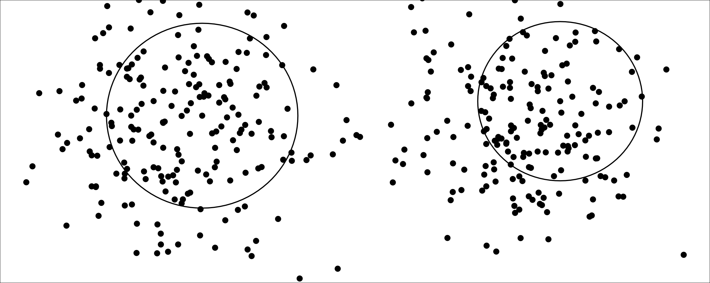

CCD Clustering
=====

Unsupervised Learning with Cluster Catch Digraphs (CCDs)


Installation
------------

``` r
library(devtools)
devtools::install_github("Artur-man/CCDClustering")
```

Example
-------

``` r
# library
library(MASS)
library(cluster)

# source codes
source("ccd_ripley.R")
source("functions.R")
source("ccdfunctions.R")
source("Kest.R")

# generate data
set.seed(1)
n <- 200
c1.mu <- c(0,0)
c2.mu <- c(5,0)
sigma <- diag(2)
datax <- mvrnorm(n,c1.mu,sigma)
datay <- mvrnorm(n,c2.mu,sigma)
dataf <- rbind(datax,datay)
ddataf <- as.matrix(dist(dataf))

# train clustering with CCDs
simul <- Kest.simpois.edge(n,2,50,99)
ccd.sim <- rccd.clustering_correct(dataf, low.num=10, r.seq=50, dom.method = "greedy2", simul)

# find the best covering balls
ccd.si <- rccd.silhouette(ccd.sim,ddataf)
lind <- ccd.si$si.ind
ccd.sim$Int.D <- ccd.sim$Int.D[1:lind]
ccd.sim$Int.R <- ccd.sim$Int.R[1:lind]

# print the clusters
par(mar=c(0,0,0,0))
plot(dataf,xlab="",ylim=c(-2.3,1.75),ylab="",pch=16,cex=1.5,axes=FALSE)
box()
D <- ccd.sim$Int.D
R <- ccd.sim$Int.R
for(i in 1:length(D))
  draw.circle(dataf[D[i],1],dataf[D[i],2],R[i],lwd=2)
```


